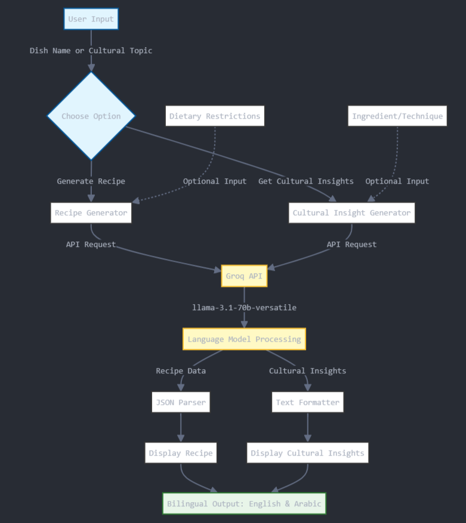

**Exciting Project: Moroccan Cuisine Recipe Generator and Cultural Insight Tool 🚀**
===============================================================================

**Overview**
-----------

This project combines the power of AI with the richness of Moroccan culture to generate authentic recipes and provide cultural insights about ingredients and techniques. Utilizing the llama-3.1-70b-versatile model and the Groq API, this tool provides lightning-fast responses while considering dietary restrictions.

**Features**
------------

* **Authentic Moroccan Recipes**: Generates traditional Moroccan recipes with detailed instructions.
* **Cultural Insights**: Provides information about the cultural significance of ingredients and cooking techniques.
* **Bilingual Output**: Offers output in both English and Arabic.
* **Dietary Restrictions**: Considers various dietary restrictions, such as vegetarian, gluten-free, and more.
* **Lightning-Fast Responses**: Powered by Groq API and llama-3.1-70b-versatile model for rapid responses.

**Workflow Diagram**
--------------------

**Motivation**
-------------

The llama-3.1-70b-versatile model has been available for some time, but latency issues held me back from integrating it into projects. Thanks to Groq, I can now share this passion project with the world. This tool showcases the potential of AI in preserving and sharing cultural heritage through cuisine, blending technology and tradition in a unique way.

**Getting Started**
-------------------

To get started with this project, please follow these steps:

1. **Find your GROQ_API_KEY**: Go to https://console.groq.com/keys and retrieve your API key.
2. **Add API key to .env file**: Create a new file named `.env` in the project root directory and add the following line: `GROQ_API_KEY=YOUR_API_KEY_HERE`
3. **Launch the Streamlit app**: Run the command `streamlit run main.py` to launch the application.

**Contributing**
---------------

If you're interested in contributing to this project, please fork the repository and submit a pull request. I'm open to suggestions, bug fixes, and new feature ideas.

**License**
----------

This project is licensed under **Free**.

**Acknowledgments**
----------------

I'd like to thank Groq for their API and the developers of the llama-3.1-70b-versatile model.

**Contact**
---------

If you have any questions or need help with the project, please don't hesitate to reach out to me at **abdellatif.belmady@gmail.com**.
